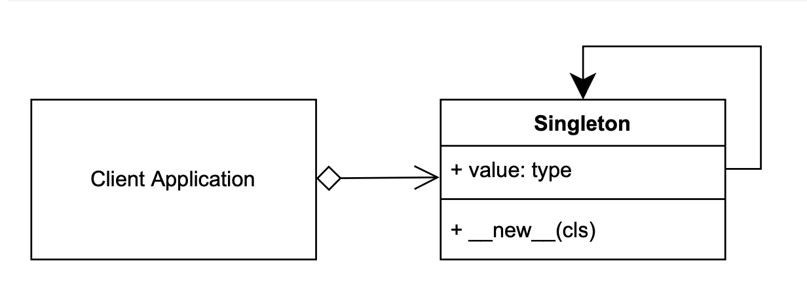

# Singleton Design Pattern

## Singleton UML Diagram 
                
                
# Example to show Concept of Singleton Design Pattern

## Output:
```
python3 ./singleton/singleton_concept.py
id(Singleton)   = 5190809136
id(OBJECT1)     = 5190809136
id(OBJECT2)     = 5190809136
id(OBJECT1)     = 5190809136
```


# Overview to run the code to design a Leaderboard of Games
## Output:
```
python3 ./singleton/client.py 
-----------Leaderboard-----------
|       1       |       Mridula |
|       2       |       Satyam  |
|       3       |       Sonali  |

-----------Leaderboard-----------
|       1       |       Mridula |
|       2       |       Satyam  |
|       3       |       Sonali  |

-----------Leaderboard-----------
|       1       |       Mridula |
|       2       |       Satyam  |
|       3       |       Sonali  |


```

Here, leaderboard has single instance. So, there is one dictionary (_table) which is updated each time called. In result the table has same values. This is an example of Singleton Design Pattern.
