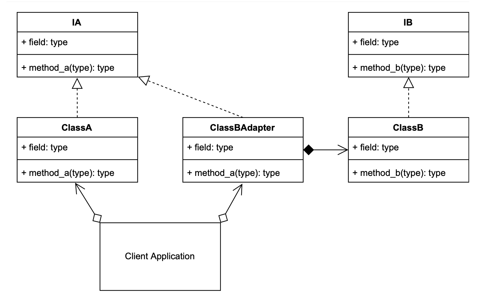

# Adapter Design Pattern

You may have two classes that are similar, but they have different method signatures, so you create an Adapter over top of one of the method signatures so that it is easier to implement and extend in the client.

The Adapter is used when you have an existing interface that doesn't directly map to an interface that the client requires. So, then you create the Adapter that has a similar functional role, but with a new compatible interface.

Terminology:
• Target: The domain specific interface or class that needs to be adapted.
• Adapter Interface: The interface of the target that the adapter will need to implement. • Adapter: The concrete adapter class containing the adaption process.
• Client: The client application that will use the Adapter.

## DecoraAdaptertor UML Diagram 
                
                
# Example to show Concept of Adapter Design Pattern

## Output:
```
python3 ./adapter/adapter_concept.py
method A
method B
method A
method B
```


# Overview to run the code to design a Adapter Use Case
## Output:
```
python3 ./adapter/client.py 
Company A is busy, trying company B
Company B is busy, trying company A
Company A is busy, trying company B
Company B is busy, trying company A
Company A building Cube id:4369040640, 8x7x1
Company A is busy, trying company B
Company B building Cube id:4369040640, 9x4x2
Company A building Cube id:4369040784, 9x6x2
Company A is busy, trying company B
Company B is busy, trying company A
Company A building Cube id:4369040640, 1x8x6
Company A is busy, trying company B
Company B building Cube id:4369040640, 5x7x6
5 cubes have been manufactured
```

