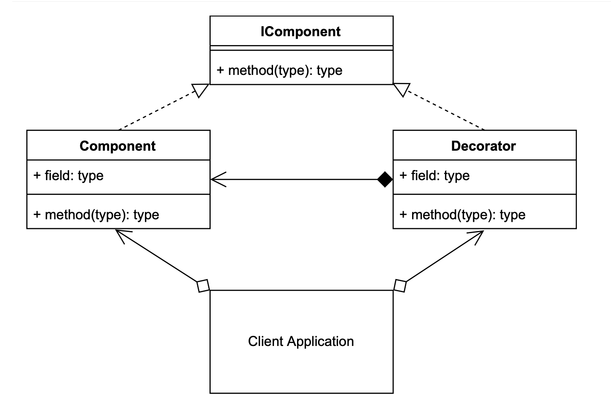

# Decorator Design Pattern

## Decorator UML Diagram 
                
                
# Example to show Concept of Singleton Design Pattern

## Output:
```
python3 ./decorator/decorator_concept.py
Component Method
Decorator Method(Component Method)
```


# Overview to run the code to design a Leaderboard of Games
## Output:
```
python3 ./decorator/client.py 
22
110
44
56
-1
156
15
154
10
12
54
```

